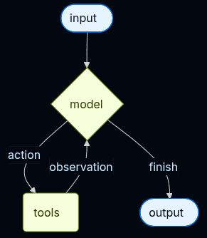
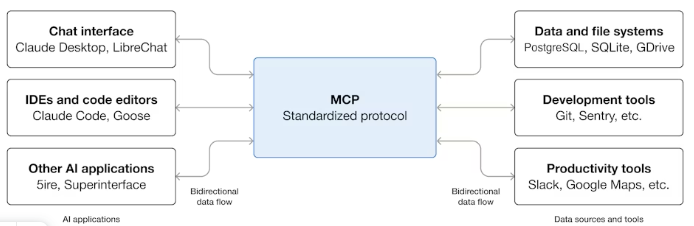
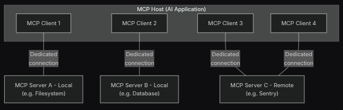

# Краткая сводка по LangChain

- Инструменты позволяют модели взаимодействовать с внешними сервисами, вызывая определенные функции.

- Мы можем реализовать два вида памяти, которая также может делиться на разные подвиды: Short memory (InMemory, Postgre), Long-Term memory (InMemory, Postgre).

- У LangChain есть более низкоуровневый фреймворк - DeepAgents

## Основыне компоненты 

- Агенты объединяют языковые модели с инструментами для создания систем, которые могут анализировать задачи.

- create_agent создает среду выполнения агента на основе графа с использованием LangGraph.

- модель может задаваться разными способами

- Кратковременная память (Short-Memory) позволяет приложению запоминать предудущие взаимодействия в рамках одного потока или диалога.

- История переписки - самая распространенная форма кратковременной памяти. Большинство моделей плохо справляются с длинными контекстными окнами.

- Мы можем реализовать обрезку контекста для поддержания модели.

- Чтобы получить структурированный ответ мы можем использовать несколько разных подходов.
    1. response_format в create_agent - для управления возвратом структурированных данных агентом:
        1. ToolStrategy[StructuredResponseT]: Использует инструмент для вызова структурированного вывода
        2. ProviderStrategy[StructuredResponseT]: Использует структурированный вывод, настроенный провайдером
        3. Простая схема

        Ограничения: 
        - ProviderStrategyесли выбранная модель и провайдер поддерживают собственный структурированный вывод (например, OpenAI, Anthropic (Claude) или xAI (Grok)).
        - ToolStrategyдля всех остальных моделей
    2. использовать with_structed_output без агента, на уровне llm

- Промежуточное программное обеспечение позволяет более жестко контролировать то, что происходит внутри агента. LangChain и Deep Agents предоставляют готовые промежуточные программные модули для распространенных сценариев использования. Каждый промежуточный программный модуль готов к использованию и может быть настроен в соответствии с вашими потребностями.
​

# Кратко про MCP

MCP (Model Context Protocol) — это стандарт с открытым исходным кодом для подключения ИИ-приложений к внешним системам.

MCP использует клиент-серверную архитектуру, при которой хост MCP — приложение с искусственным интеллектом, такое как Claude Code или Claude Desktop, — устанавливает соединения с одним или несколькими серверами MCP. 

Ключевые участники: 
- MCP Host: приложенеи с ИИ;
- MCP ClientЖ: компонент, поддерживающий соединение с сервером MCP;
- MCP Server: программа, предоставляющая контекст клиентам MCP.

## MCP состоит из двух слоев

**Уровень данны:** определяет протокол на основе JSON-RPC для взаимодействия между клиентом и сервером.

**Транспортный уровень:** определяет механизмы и каналы связи, обеспечивающие обмен данными между клиентами и серверами.

### Уровень данных

Реализация: 
- **Управление жизненным циклом**: отвечает за инициализацию подключения, согласование возможностей и завершение подключения между клиентами и серверами;

- **Возможности сервера**: позволяет серверам предоставлять базовые функции, в том числе инструменты для работы с искусственным интеллектом, ресурсы для контекстных данных и подсказки для шаблонов взаимодействия с клиентом и от клиента;

- **Возможности клиента**: позволяет серверам запрашивать у клиента выборку данных из хост-модели LLM, получать вводные данные от пользователя и отправлять клиенту сообщения в журнал;

### Транспортный уровень

Два транспортных механизма:
- **Транспортный протокол Stdio**: использует стандартные потоки ввода/вывода для прямой межпроцессной коммуникации между локальными процессами на одном компьютере;

- **Потоковый транспортный протокол HTTP**: использует HTTP POST для обмена сообщениями между клиентом и сервером с опциональными событиями, отправляемыми сервером, для потоковой передачи данных. Этот транспортный протокол обеспечивает связь с удаленным сервером и поддерживает стандартные методы HTTP-аутентификации, включая токены-носители, API-ключи и пользовательские заголовки. MCP рекомендует использовать OAuth для получения токенов аутентификации.

## Примитивы

Примитивы MCP - важнейшая концепция в рамках MCP. Они определяют, что клиенты и серверы могут предложить друг другу.

MCP выделяет три основных примитива, которые могут предоставлять серверы:
- **Инструменты**: исполняемые функции, которые могут вызывать приложения с искусственным интеллектом для выполнения действий (например, операций с файлами, вызовов API, запросов к базе данных);

- **Ресурсы**: источники данных, предоставляющие контекстную информацию для приложений с искусственным интеллектом (например, содержимое файлов, записи в базе данных, ответы API)
Статические данные.

- **Промпты**: многократно используемые шаблоны, которые помогают структурировать взаимодействие с языковыми моделями (например, системные промпты, примеры с малым количеством примеров)

MCP также определяет примитивы, которые могут предоставлять клиенты. 
- **Sampling**: для независимости от конкретной модели и ее SDK

- **Elicitation**: позволяет серверам запрашивать у пользователей дополнительную информацию. `elicitation/create`;

- **Ведение журнала**: позволяет серверам отправлять клиентам сообщения журнала для отладки и мониторинга.

>> https://modelcontextprotocol.io/docs/getting-started/intro